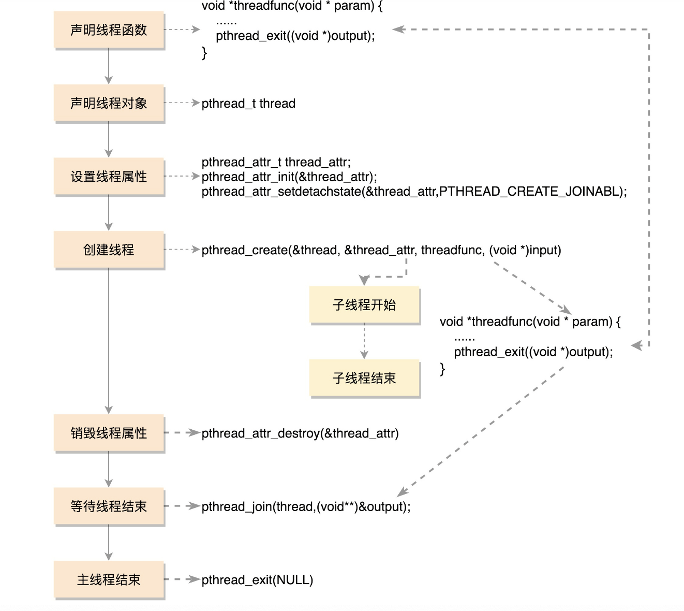

# 如何让复杂的项目并行执行
## 为什么要有线程
```
每个进程有一个默认的主线程

线程负责执行二进制的指令

进程 指令执行 内存 文件系统资源都需要进程来管理

主线程:进程交给他的大任务,从头执行到尾部

进程 资源独立的 只能通过互相发送消息通信
线程 资源共享
```
## 如何创建线程
#### 线程创建过程

```
线程的任务:一个函数
// 多线程依赖 libpthread.so 的库
gcc  xxxx.c -l pthread
```
### 线程的数据
```c
1.线程上的基本数据
    栈(每个线程都有独立的栈)
    
    ulimit -a
    // 每个线程栈的大小
    stack size              (kbytes, -s) 8192
    // 可以修改线程栈
    ulimit -s
    or 
    // 修改当前线程栈的大小
    #include <pthread.h>
    int pthread_attr_setstacksize(pthread_attr_t *attr, size_t stacksize);
    int pthread_attr_getstacksize(pthread_attr_t *attr, size_t *stacksize);


2.线程共享全局数据

3.线程私有数据
  key 一旦创建成功 所有线程都可以访问,每个线程可以根据自己的需要往key中填入不同的值  
  int pthread_key_create(pthread_key_t *key, void (*destructor)(void*))

  int pthread_setspecific(pthread_key_t key, const void *value)
  
  void *pthread_getspecific(pthread_key_t key)

  线程接收调用  destructor 来进程释放 value
```
### 数据保护
```
互斥锁
pthread_mutex_xx()


```