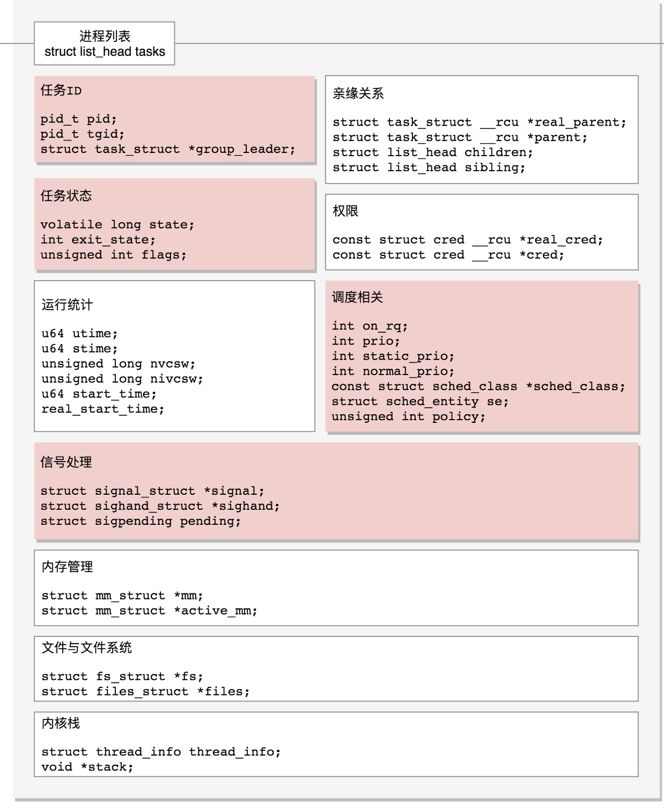

# 线程的数据结构

```c
线程和进程在内核里面都叫做任务,由task_struct进行管理

struct task_struct {
    //链表 将所有的 tast_struct 串起来
    struct list_head		tasks;
    
    // process id
    pid_t				pid;
    //thread group id
	pid_t				tgid;
    struct task_struct		*group_leader;
}

进程只有main thread
    pid 自己
    tgid 自己 
    group leader 自己

任务展示
    ps
任务下发指令
    kill


```

## 信号处理
```c
struct task_struct {
    //链表 将所有的 tast_struct 串起来
    struct list_head		tasks;
    
    // process id
    pid_t				pid;
    //thread group id
	pid_t				tgid;
    struct task_struct		*group_leader;

    /* Signal handlers: */
	struct signal_struct		*signal;
    //那些信号正在处理
	struct sighand_struct __rcu		*sighand;
    // 那些信号阻塞暂时不处理
	sigset_t			blocked;
	sigset_t			real_blocked;
	/* Restored if set_restore_sigmask() was used: */
	sigset_t			saved_sigmask;
    // 那些信号尚等待处理
	struct sigpending		pending;
    // sas_ss_xxx 信号处理用户态函数栈 也可以开辟新的栈专用信号处理
	unsigned long			sas_ss_sp;
	size_t				sas_ss_size;
	unsigned int			sas_ss_flags;
}

```
## 任务状态


```c
struct task_struct{
    unsigned int			__state;
    int				exit_state;
    unsigned int			flags;		/* Specifying the scheduler behaviour	*/
}


进程状态 调度 进程运行 等状态
state:
/* Used in tsk->state: */
// 时刻准备运行
#define TASK_RUNNING			0x0000 
// 睡眠:可中断睡眠状态
// IO 完成 ,信号中断 
#define TASK_INTERRUPTIBLE		0x0001 
// 不可中断睡眠 ,任何信号中断叫不醒 除非重启
#define TASK_UNINTERRUPTIBLE		0x0002 
// SINSTOP SINTIN SIGTSTP SIGTTOU 之后进入该状态
#define __TASK_STOPPED			0x0004
// 被debugger等进程监视 当一个进程被另一个进程监视 每一个信号都会让进程进入该状态   
#define __TASK_TRACED			0x0008
/* Used in tsk->exit_state: */
#define EXIT_DEAD			0x0010
// 进程结束  EXIT_ZOMBIE  --> EXIT_DEAD
// EXIT_ZOMBIE (父进程未 wait()未等待子进程的通知)
#define EXIT_ZOMBIE			0x0020
#define EXIT_TRACE			(EXIT_ZOMBIE | EXIT_DEAD)
/* Used in tsk->state again: */
#define TASK_PARKED			0x0040
#define TASK_DEAD			0x0080
// 接收到信号是唤醒进程 
#define TASK_WAKEKILL			0x0100
#define TASK_WAKING			0x0200
#define TASK_NOLOAD			0x0400
#define TASK_NEW			0x0800


/* RT specific auxilliary flag to mark RT lock waiters */
#define TASK_RTLOCK_WAIT		0x1000
#define TASK_STATE_MAX			0x2000

/* Convenience macros for the sake of set_current_state: */
// 可以终止的新睡眠状态  只能响应致命信号
#define TASK_KILLABLE			(TASK_WAKEKILL | TASK_UNINTERRUPTIBLE)
#define TASK_STOPPED			(TASK_WAKEKILL | __TASK_STOPPED)
#define TASK_TRACED			__TASK_TRACED

#define TASK_IDLE			(TASK_UNINTERRUPTIBLE | TASK_NOLOAD)

/* Convenience macros for the sake of wake_up(): */
#define TASK_NORMAL			(TASK_INTERRUPTIBLE | TASK_UNINTERRUPTIBLE)

/* get_task_state(): */
#define TASK_REPORT			(TASK_RUNNING | TASK_INTERRUPTIBLE | \
					 TASK_UNINTERRUPTIBLE | __TASK_STOPPED | \
					 __TASK_TRACED | EXIT_DEAD | EXIT_ZOMBIE | \
					 TASK_PARKED)


flags:
进程其他一些状态

/*
 * Per process flags
 */
// 进程运行在虚拟CPU上
// account_system_time  统计系统运行时间用到 flag , call account_guest_time
#define PF_VCPU			0x00000001	/* I'm a virtual CPU */
#define PF_IDLE			0x00000002	/* I am an IDLE thread */
// 正在退出 find_alive_thread（）遇到该flag直接跳过 
#define PF_EXITING		0x00000004	/* Getting shut down */
#define PF_POSTCOREDUMP		0x00000008	/* Coredumps should ignore this task */
#define PF_IO_WORKER		0x00000010	/* Task is an IO worker */
#define PF_WQ_WORKER		0x00000020	/* I'm a workqueue worker */
// fork 完 还 没有 exec
// sys_fork()->_do_fork()->copy_process() 阶段 exec 之后就去掉 该flag
#define PF_FORKNOEXEC		0x00000040	/* Forked but didn't exec */
#define PF_MCE_PROCESS		0x00000080      /* Process policy on mce errors */
#define PF_SUPERPRIV		0x00000100	/* Used super-user privileges */
#define PF_DUMPCORE		0x00000200	/* Dumped core */
#define PF_SIGNALED		0x00000400	/* Killed by a signal */
#define PF_MEMALLOC		0x00000800	/* Allocating memory */
#define PF_NPROC_EXCEEDED	0x00001000	/* set_user() noticed that RLIMIT_NPROC was exceeded */
#define PF_USED_MATH		0x00002000	/* If unset the fpu must be initialized before use */
#define PF_NOFREEZE		0x00008000	/* This thread should not be frozen */
#define PF_FROZEN		0x00010000	/* Frozen for system suspend */
#define PF_KSWAPD		0x00020000	/* I am kswapd */
#define PF_MEMALLOC_NOFS	0x00040000	/* All allocation requests will inherit GFP_NOFS */
#define PF_MEMALLOC_NOIO	0x00080000	/* All allocation requests will inherit GFP_NOIO */
#define PF_LOCAL_THROTTLE	0x00100000	/* Throttle writes only against the bdi I write to,
						 * I am cleaning dirty pages from some other bdi. */
#define PF_KTHREAD		0x00200000	/* I am a kernel thread */
#define PF_RANDOMIZE		0x00400000	/* Randomize virtual address space */
#define PF_NO_SETAFFINITY	0x04000000	/* Userland is not allowed to meddle with cpus_mask */
#define PF_MCE_EARLY		0x08000000      /* Early kill for mce process policy */
#define PF_MEMALLOC_PIN		0x10000000	/* Allocation context constrained to zones which allow long term pinning. */
#define PF_FREEZER_SKIP		0x40000000	/* Freezer should not count it as freezable */
#define PF_SUSPEND_TASK		0x80000000      /* This thread called freeze_processes() and should not be frozen */
```
## 进程调度
```c
struct task_struct{
    // 是否在运行队列上
    int				on_rq;
    // 优先级
    int				prio;
    int				static_prio;
    int				normal_prio;
    unsigned int			rt_priority;
    // 调度器类
    const struct sched_class	*sched_class;
    // 调度实体
    struct sched_entity		se;
    struct sched_rt_entity		rt;
    struct sched_dl_entity		dl;
    // 调度策略
    unsigned int			policy;
    // 可以使用哪些 CPU
    int				nr_cpus_allowed;
    cpumask_t			cpus_allowed;
    struct sched_info		sched_info
}
```


## 运行统计信息
```c
struct task_struct{
    u64				utime;// 用户态消耗的 CPU 时间
    u64				stime;// 内核态消耗的 CPU 时间
    unsigned long			nvcsw;// 自愿 (voluntary) 上下文切换计数
    unsigned long			nivcsw;// 非自愿 (involuntary) 上下文切换计数
    u64				start_time;// 进程启动时间，不包含睡眠时间
    u64				real_start_time;// 进程启动时间，包含睡眠时间
}
```

## 进程亲缘关系

```c

/* Real parent process: */
	struct task_struct __rcu	*real_parent;

    //父进程 终止时必须向父进程发送信号
	/* Recipient of SIGCHLD, wait4() reports: */
	struct task_struct __rcu	*parent;
    //链表中所有元素都是其子进程
	struct list_head		children;
    //用于当前进程插入到兄弟链表中
	struct list_head		sibling;

real_parent 和 parent 通常是一样的
bash  
  1. ./a.out
   a.out real_parent 和 parent 是 bash 进程

  2. gdb a.out

  real_parent gdb
  parent bash
```

## 进程权限
```c
const struct cred __rcu		*real_cred;

const struct cred __rcu		*cred;
struct cred {
	atomic_t	usage;
    // 进程启动者的id
	kuid_t		uid;		/* real UID of the task */
	kgid_t		gid;		/* real GID of the task */
	kuid_t		suid;		/* saved UID of the task */
	kgid_t		sgid;		/* saved GID of the task */
    // 消息队列 共享内存 信号量的时候 会比较该用户是否具有权限
	kuid_t		euid;		/* effective UID of the task */
	kgid_t		egid;		/* effective GID of the task */
    //对文件操作审核的权限
	kuid_t		fsuid;		/* UID for VFS ops */
	kgid_t		fsgid;		/* GID for VFS ops */

    kernel_cap_t	cap_inheritable; /* caps our children can inherit */
	kernel_cap_t	cap_permitted;	/* caps we're permitted */
	kernel_cap_t	cap_effective;	/* caps we can actually use */
	kernel_cap_t	cap_bset;	/* capability bounding set */
	kernel_cap_t	cap_ambient;	/* Ambient capability set */
} __randomize_layout;

struct cred  大部分是用户和用户所属组的关系


一般情况:
uid euid fsuid 一样
gid egid fsgid 一样

特殊情况:
    
    使命召唤.out B 安装  rwx-r--

    B 给 other x权限
    rwx-r-x---x

   A 用户
   ./使命召唤.out
   process{
        uid euid fsid 
        gid egid fsgid
   }
   都是用户A
   
   A通关保存进度  使命召唤_process.txt rw--- --- (B)
   
   A发现保存不进去

  解决 
  chmod u+s xxx 给游戏程序设定用户标识位

  A 在次启动程序  
     process{
        uid  A
        euid B
        fsid  B
        gid A
        egid B
        fsgid B
   }


// linux 另一种机制 capabilities
用于普通用户想做点高权限的事情
capability.h
// 可以执行对应的权限位
#define CAP_CHOWN            0
#define CAP_KILL             5
#define CAP_NET_BIND_SERVICE 10
#define CAP_NET_RAW          13
#define CAP_SYS_MODULE       16
#define CAP_SYS_RAWIO        17
#define CAP_SYS_BOOT         22
#define CAP_SYS_TIME         25
#define CAP_AUDIT_READ          37
#define CAP_LAST_CAP         CAP_AUDIT_READ
.....

// 进程能够使用的权限
kernel_cap_t	cap_permitted;	/* caps we're permitted */
kernel_cap_t	cap_effective;	/* caps we can actually use */

 
// exec 会继承调用者的 inheritable 集合 将其加入到 permited集合
// 当前执行文件设置的 inheritable
// 非root 下不会保留  cap_inheritable 到 permited集合
kernel_cap_t	cap_inheritable; /* caps our children can inherit */


//  capability bounding set 系统中所有进程保存的权限
// 该继承不存在的权限 即使 root 以没有
kernel_cap_t	cap_bset;	/* capability bounding set */


// 非root exec  cap_ambient 会被添加  cap_permitted 和 cap_effective
kernel_cap_t	cap_ambient;	/* Ambient capability set */
```
## 内存管理
```c
struct mm_struct                *mm;
struct mm_struct                *active_mm;
```
## 文件与文件系统
```c
/* Filesystem information: */
struct fs_struct                *fs;
/* Open file information: */
struct files_struct             *files;

每一个进程有一个文件系统的数据结构
```


## 用户态函数栈

```c
struct thread_info		thread_info;
void				*stack;

ESP :栈顶指针寄存器
push  pop 指令会自动调整ESP的值

EBP: 栈的基地址寄存器,指向当前栈的最底部

A(){
    B()
}
stack:
[
    调用A()结束地址
    A函数的局部变量数据
    B()的结束地址
    B函数的局部变量
    .....

]

64bit
rsp rbp push pop ....

函数参数传递寄存器 rdi rsi rdx rcx r8 r9 ..... 如果操作6个参数放入栈里面去

```
## 内核态函数栈
```c
struct thread_info		thread_info;
void				*stack;

stack 就是内核栈

每个进程分配的内核栈
arch/x86/include/asm/page_(32/64)_types.h

32位 至少 4k*2
#define THREAD_SIZE_ORDER	1
#define THREAD_SIZE		(PAGE_SIZE << THREAD_SIZE_ORDER)


64位 至少 4k*4
#define THREAD_SIZE_ORDER	(2 + KASAN_STACK_ORDER)
#define THREAD_SIZE  (PAGE_SIZE << THREAD_SIZE_ORDER)
```
### 内核栈的数据结构

```c
struct thread_info		thread_info;
void				*stack;

thread_info 对task_truct 的一个补充


//x86
#ifndef __ASSEMBLY__
#ifdef __i386__

struct pt_regs {
	/*
	 * NB: 32-bit x86 CPUs are inconsistent as what happens in the
	 * following cases (where %seg represents a segment register):
	 *
	 * - pushl %seg: some do a 16-bit write and leave the high
	 *   bits alone
	 * - movl %seg, [mem]: some do a 16-bit write despite the movl
	 * - IDT entry: some (e.g. 486) will leave the high bits of CS
	 *   and (if applicable) SS undefined.
	 *
	 * Fortunately, x86-32 doesn't read the high bits on POP or IRET,
	 * so we can just treat all of the segment registers as 16-bit
	 * values.
	 */
	unsigned long bx;
	unsigned long cx;
	unsigned long dx;
	unsigned long si;
	unsigned long di;
	unsigned long bp;
	unsigned long ax;
	unsigned short ds;
	unsigned short __dsh;
	unsigned short es;
	unsigned short __esh;
	unsigned short fs;
	unsigned short __fsh;
	/*
	 * On interrupt, gs and __gsh store the vector number.  They never
	 * store gs any more.
	 */
	unsigned short gs;
	unsigned short __gsh;
	/* On interrupt, this is the error code. */
	unsigned long orig_ax;
	unsigned long ip;
	unsigned short cs;
	unsigned short __csh;
	unsigned long flags;
	unsigned long sp;
	unsigned short ss;
	unsigned short __ssh;
};

#else /* __i386__ */

struct pt_regs {
/*
 * C ABI says these regs are callee-preserved. They aren't saved on kernel entry
 * unless syscall needs a complete, fully filled "struct pt_regs".
 */
	unsigned long r15;
	unsigned long r14;
	unsigned long r13;
	unsigned long r12;
	unsigned long bp;
	unsigned long bx;
/* These regs are callee-clobbered. Always saved on kernel entry. */
	unsigned long r11;
	unsigned long r10;
	unsigned long r9;
	unsigned long r8;
	unsigned long ax;
	unsigned long cx;
	unsigned long dx;
	unsigned long si;
	unsigned long di;
/*
 * On syscall entry, this is syscall#. On CPU exception, this is error code.
 * On hw interrupt, it's IRQ number:
 */
	unsigned long orig_ax;
/* Return frame for iretq */
	unsigned long ip;
	unsigned long cs;
	unsigned long flags;
	unsigned long sp;
	unsigned long ss;
/* top of stack page */
};


// 上面是用于保存CPU上下文切换的寄存器信息
```
## 通过内核栈找到 task_struct 结构
```c
struct thread_info {
	struct task_struct	*task;		/* main task structure */
	__u32			flags;		/* low level flags */
	__u32			status;		/* thread synchronous flags */
	__u32			cpu;		/* current CPU */
	mm_segment_t		addr_limit;
	unsigned int		sig_on_uaccess_error:1;
	unsigned int		uaccess_err:1;	/* uaccess failed */
};

```