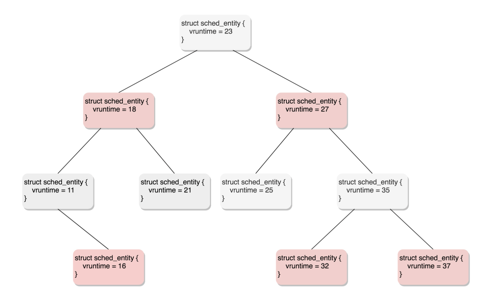
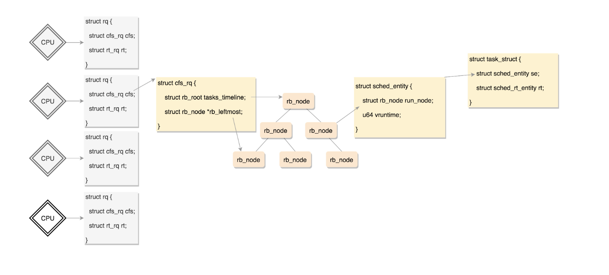

# 调度
```c
struct task_struc {
    unsigned int policy;//调度策略
    // 优先级
    // 实时进程 [0,99] 
    // 普通进程 [100,139]
    int				prio;
	int				static_prio;
	int				normal_prio;
	unsigned int			rt_priority;
}

/*
 * Scheduling policies
 */
#define SCHED_NORMAL		0
#define SCHED_FIFO		1
#define SCHED_RR		2
#define SCHED_BATCH		3
/* SCHED_ISO: reserved but not implemented yet */
#define SCHED_IDLE		5
#define SCHED_DEADLINE		6

```

## 实时调度策略
```c
#define SCHED_FIFO		1
    优先级高的抢占优先级低的
    相同优先级先来先执行
#define SCHED_RR		2
    轮流调度算法
    相同优先级用完时间盘放在队列尾部
    高优先级可以抢占优先级低的任务
#define SCHED_DEADLINE		6
    按照deadline调度,按照时间最近的deadlie调度
```

## 普通调度
```c
// 普通进程 
#define SCHED_NORMAL		0
// 后台进程 默默执行 优先级不需要特别的高
#define SCHED_BATCH		3
/* SCHED_ISO: reserved but not implemented yet */
// 当特备空闲的时候执行
#define SCHED_IDLE		5


struct task_struct{
    const struct sched_class	*sched_class;
}


sched_class 的几种实现

extern const struct sched_class stop_sched_class;
    优先级最高的任务使用该策略,中断所有进程 不会被其他进程中断
extern const struct sched_class dl_sched_class;
    deadline 调度策略
extern const struct sched_class rt_sched_class;
    rr or fifo 调度
    根据 task_policy 指定
extern const struct sched_class fair_sched_class;
    普通进程调度策略
extern const struct sched_class idle_sched_class;
    空闲进程调度策略


```

### 完全公平调度算法
```c
CFS(completely fair scheduling)
    cpu 每段时间滴答(触发时钟中断 tick)
tick 到来 vruntime 不断增大


虚拟运行时间 vruntime += 实际运行时间 delta_exec * NICE_0_LOAD/ 权重

同一运行时间的情况下
权重 越大 vruntime 越小
```

### 调度队列和调度实体
```c
排序进程 找出最小 ,能够快速的更新task 数据

平衡查询和跟新选择红黑树数据结构

struct task_struct{
    // 完全公平调度实体
    // 如果该进程是普通进程通过  sched_entity 将自己挂在红黑树上
    struct sched_entity se;
    // 实时调度实体
    struct sched_rt_entity rt;
    // deadline 调度实体
    struct sched_dl_entity dl;
}


// 普通进程挂载的调度实体 
struct sched_entity {
	/* For load-balancing: */
	struct load_weight		load; //权重
	struct rb_node			run_node;
	struct list_head		group_node;
	unsigned int			on_rq;

	u64				exec_start;
	u64				sum_exec_runtime;
	u64				vruntime;//运行时间
	u64				prev_sum_exec_runtime;

	u64				nr_migrations;

.....
};
```

```c
CFS 会选择最左面的叶子节点来进行下一个CPU运行


每个cpu有自己的rq数据结构,rt_rq ,cfs_rq

struct rq {
	/* runqueue lock: */
	raw_spinlock_t lock;
	unsigned int nr_running;
	unsigned long cpu_load[CPU_LOAD_IDX_MAX];
......
	struct load_weight load;
	unsigned long nr_load_updates;
	u64 nr_switches;
 
 
	struct cfs_rq cfs;
	struct rt_rq rt;
	struct dl_rq dl;
......
	struct task_struct *curr, *idle, *stop;
......
}

struct cfs_rq {
    struct load_weight load;
	unsigned int nr_running, h_nr_running;
 
 
	u64 exec_clock;
	u64 min_vruntime;
#ifndef CONFIG_64BIT
	u64 min_vruntime_copy;
#endif
    // 红黑树的root节点
	struct rb_root tasks_timeline;
    // 最左节点
	struct rb_node *rb_leftmost;
 
 
	struct sched_entity *curr, *next, *last, *skip;
......
}

```



## 主动调度如何发生
```

1.A 项目 sleep 让出cpu 换成B项目执行
2.A 项目时间太久 ,调度器主动调度到B项目执行

```