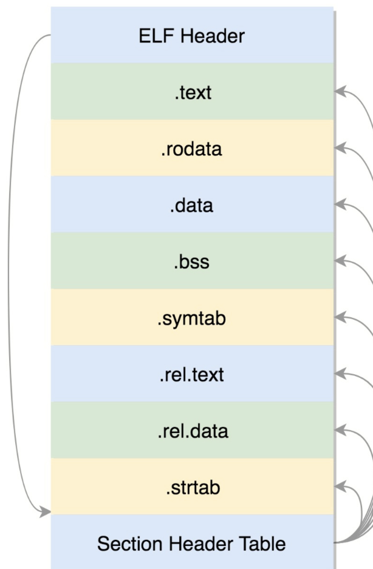
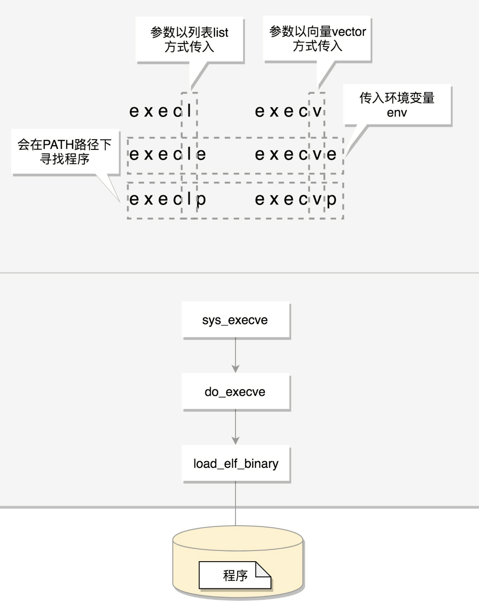
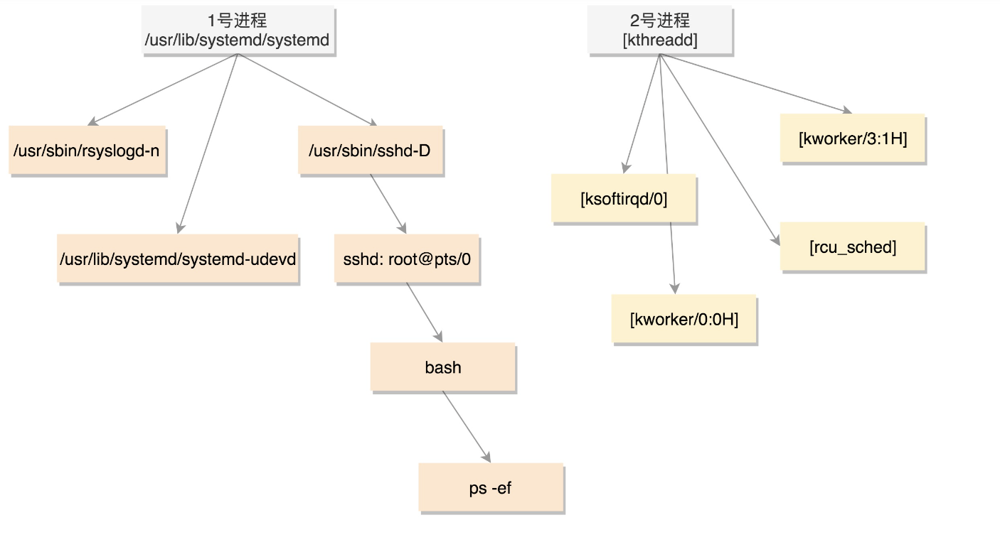

# 进程
## 编译
```
gcc  -c -fPIC xxxx.c

-fPIC 编译成可重定位的文件
```
## elf文件


```c
.text 执行代码
.data 已经初始化的全局变量
.rodata 只读数据 字符串 const 变量
.bss 未初始化的全局变量(运行时会被设置为0)

.symtab 符号表 记录函数 变量
.strtab 字符串表 字符串常量 变量名


Section Header Table 每个section 都存在里面
//table 每项信息
typedef struct Elf32_Shdr;
typedef struct Elf64_Shdr
```
### 可重定位文件
```c
.rel.text
.rel.data
上面的这两个section 与从定位有关

例如:
main.c
extern int create_process(char *program, char **arg_list);

int main(int argc, char const *argv[])
{
    char *arg_list[] = {
        "ls",
        "-l",
        "/etc/yum.repos.d/",
        NULL};
    create_process("ls", arg_list);
    return 0;
}

gcc -c main.c

readelf -a main.o

Relocation section '.rela.text' at offset 0x230 contains 5 entries:
  Offset          Info           Type           Sym. Value    Sym. Name + Addend
000000000013  00050000000b R_X86_64_32S      0000000000000000 .rodata + 0
00000000001b  00050000000b R_X86_64_32S      0000000000000000 .rodata + 3
000000000023  00050000000b R_X86_64_32S      0000000000000000 .rodata + 6
000000000037  00050000000a R_X86_64_32       0000000000000000 .rodata + 0
00000000003c  000a00000002 R_X86_64_PC32     0000000000000000 create_process - 4 //标注 


在 main.c 中 由于不知到 create_process 的具体位置 只好放在rel.text 里面标注


create_process 可以是动态提供也可以是静态提供

静态库创建
ar cr libcreate_process.a create_process.o 
连接静态库编译成可执行的文件
gcc -o main  main.o -L. -l create_process

-L . 在当前目录下找 
-l   create_process 在选择静态库过程中会 lib+create_process+.a 去寻找
```
### 可执行文件

```c
可执行文件是多个.o文件合并出来的
ELF Header
Segment Header Table
代码段

数据段

不加入内存的段


Segment:将多个小的section 合并成 大的segement
typedef struct Elf32_Phdr;
typedef struct Elf64_Phdr;

typedef struct
{
  Elf64_Word	p_type;			/* Segment type */
  Elf64_Word	p_flags;		/* Segment flags */
  Elf64_Off	p_offset;		/* Segment file offset */
  Elf64_Addr	p_vaddr;		/* Segment virtual address */ 段加载到内存的那个虚拟位置
  Elf64_Addr	p_paddr;		/* Segment physical address */
  Elf64_Xword	p_filesz;		/* Segment size in file */
  Elf64_Xword	p_memsz;		/* Segment size in memory */
  Elf64_Xword	p_align;		/* Segment alignment */
} Elf64_Phdr;


typedef struct
{
  unsigned char	e_ident[EI_NIDENT];	/* Magic number and other info */
  Elf64_Half	e_type;			/* Object file type */
  Elf64_Half	e_machine;		/* Architecture */
  Elf64_Word	e_version;		/* Object file version */
  Elf64_Addr	e_entry;		/* Entry point virtual address */ //虚拟地址 程序的入口
  Elf64_Off	e_phoff;		/* Program header table file offset */
  Elf64_Off	e_shoff;		/* Section header table file offset */
  Elf64_Word	e_flags;		/* Processor-specific flags */
  Elf64_Half	e_ehsize;		/* ELF header size in bytes */
  Elf64_Half	e_phentsize;		/* Program header table entry size */
  Elf64_Half	e_phnum;		/* Program header table entry count */
  Elf64_Half	e_shentsize;		/* Section header table entry size */
  Elf64_Half	e_shnum;		/* Section header table entry count */
  Elf64_Half	e_shstrndx;		/* Section header string table index */
} Elf64_Ehdr;


连接一旦形成 section 合并 静态连接的程序就不需要依赖任何库

静态链接缺点:
当有很多程序使用了该静态库 如果改静态库更新则全部依赖该静态库的都要重新静态链接
```
### 动态连接
```c

gcc -shared -fPIC  create_process.c -o libcreate_process.so 
// note: 动态文件名必须 lib+name+.so
gcc -o main main.c -L. -l create_process

//设置动态连接的地址
LD_LIBRARY_PATH =xxx


动态连接库是ELF的第三种类型
file libcreate_process.so 
libcreate_process.so: ELF 64-bit LSB shared object, x86-64, version 1 (SYSV), dynamically linked, BuildID[sha1]=3924b279672f30264e21c8503fc3c6bfef7d2541, not stripped


连接了动态连接库的可执行文件
有.interp 的 Segment 里面是 ld-linux.so 动态连接器 
.plt:  链接表 
.got.plt 全局偏移量表

// plt 项 
// plt 相当于是代理
0000000000400510 <create_process@plt>:
  400510:	ff 25 12 0b 20 00    	jmpq   *0x200b12(%rip)        # 601028 <create_process>
  400516:	68 02 00 00 00       	pushq  $0x2
  40051b:	e9 c0 ff ff ff       	jmpq   4004e0 <.plt>


00000000004004e0 <.plt>:
  4004e0:	ff 35 22 0b 20 00    	pushq  0x200b22(%rip)        # 601008 <_GLOBAL_OFFSET_TABLE_+0x8>
  4004e6:	ff 25 24 0b 20 00    	jmpq   *0x200b24(%rip)        # 601010 <_GLOBAL_OFFSET_TABLE_+0x10>
  4004ec:	0f 1f 40 00          	nopl   0x0(%rax)


main 函数 调用  create_process@plt

00000000004005f2 <main>:
    
  40062d:	e8 de fe ff ff       	callq  400510 <create_process@plt>


Relocation section '.rela.dyn' at offset 0x460 contains 1 entry:
  Offset          Info           Type           Sym. Value    Sym. Name + Addend
000000600ff8  000200000006 R_X86_64_GLOB_DAT 0000000000000000 __gmon_start__ + 0

// .rela.plt 表 
Relocation section '.rela.plt' at offset 0x478 contains 3 entries:
  Offset          Info           Type           Sym. Value    Sym. Name + Addend
000000601018  000100000007 R_X86_64_JUMP_SLO 0000000000000000 __libc_start_main@GLIBC_2.2.5 + 0
000000601020  000200000007 R_X86_64_JUMP_SLO 0000000000000000 __gmon_start__ + 0
000000601028  000300000007 R_X86_64_JUMP_SLO 0000000000000000 create_process + 0


plt 是调用动态库的一个代理 
got 表 在编译器就存在,只是没有函数具体在内存的真实地址

main {
    call plt_crtate() //跳到代理 在编译器确定
}

plt_create() 知道 编译器确定 got内存存储 create()的函数地址(一开始没有放置)

当 ld 把函数放入 到 got 表里面的时候获取函数地址执行

```

## 运行程序未进程
```c
linux_binfmt;//结构体用来定义二进制加载方法
struct linux_binfmt {
	struct list_head lh;
	struct module *module;
	int (*load_binary)(struct linux_binprm *);
	int (*load_shlib)(struct file *);
	int (*core_dump)(struct coredump_params *cprm);
	unsigned long min_coredump;	/* minimal dump size */
} __randomize_layout;

//ELF 格式对应
static struct linux_binfmt elf_format = {
	.module		= THIS_MODULE,
	.load_binary	= load_elf_binary,
	.load_shlib	= load_elf_library,
	.core_dump	= elf_core_dump,
	.min_coredump	= ELF_EXEC_PAGESIZE,
};

load_elf_library()
do_execve()->do_execveat_common->exec_binprm->search_binary_handler

```



## 进程树

```c
centos 7 1 号进程
lrwxrwxrwx 1 root root 22 Feb 10  2022 /sbin/init -> ../lib/systemd/systemd

init 进程会启动很多daemon进程为系统提供服务

sshd:root@xxx:root用户通过ssd登录时形成的下面进程树


ps -ef
UID        PID  PPID  C STIME TTY          TIME CMD
root         1     0  0 Sep04 ?        00:12:17 /usr/lib/systemd/systemd --switched-root --system --deser//init 进程
root         2     0  0 Sep04 ?        00:00:38 [kthreadd] // 内核线程 
root     24026 19349  0 11:25 pts/0    00:00:00 /usr/bin/bash --init-file /root/.

TTY ？表示后台线程

```
